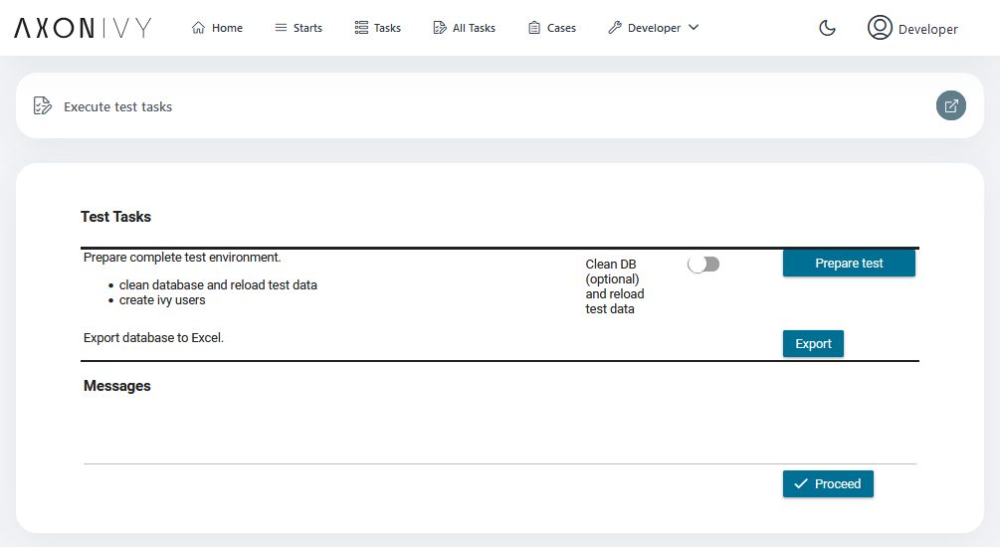
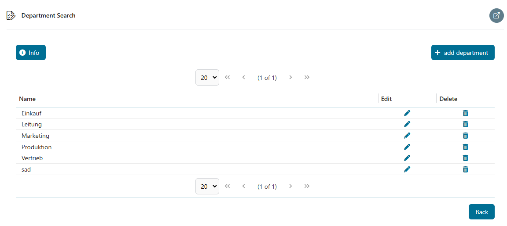
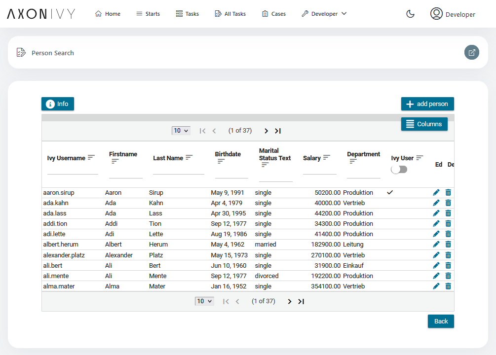

# Persistence Utils
Axon Ivy's JPA Persistence Lib utility helps you accelerate process automation initiatives by introducing an abstraction DAO layer. This utility:
- Allows robust and complex database access based on the [JPA 2.2 standard](https://www.oracle.com/java/technologies/persistence-jsp.html).
- Helps you create DAO classes for your entities with direct access to databases using standard APIs
- Simplifies the creation of typical entity classes
- Supports you with a demo implementation
- Shows example usage of some optional related technologies

## Projects
- *persistence-utils-demo* the demo project
- *persistence-utils-demo-tool* tool tp generate test data for the demo project
- *persistence-utils-test* JUnit tests for the persistence library and the demo project
- *persistence-utils-demo* JUnit web test demo

## Release Notes

### 10.0.8
*Changes*

- [APS-224](https://1ivy.atlassian.net/browse/APS-224) Fix handling of empty lists or null values in enum SearchFilters
- [APS-226](https://1ivy.atlassian.net/browse/APS-226) Fix fetching of external database to method compatible with Ivy 10 and Ivy 11

### 10.0.7
*Changes*

- Added missing documentation of 10.0.5
- Fixed sorting of CMS to locale aware case insensitive

*Incompatibilities*
- Note: This note was added to 10.0.5: `HasCmsName` is now part of the persistence utils, if you have your own, you need to replace or inherit.

### 10.0.6
*Changes*

- Fixed web test

### 10.0.5
*Changes*

- [APS-206](https://1ivy.atlassian.net/browse/APS-206) Make forceSingleResult more general
- [APS-220](https://1ivy.atlassian.net/browse/APS-220) Add convenience functions for search filter implementation
  - New functions in GenericDAO to help implementing SearchFilters containing enumerations with CMS names.
  - Access to currently built search query while predicates are built.
- [APS-222](https://1ivy.atlassian.net/browse/APS-222) Update Logging and DB GUI in Junit tests

*Incompatibilities*
- `FilterPredicate.getSearchFilter` was renamed to `FilterPredicate.getSearchEnum`
- `FilterOrder.getSearchFilter` was renamed to `FilterOrder.getSearchEnum`
- `HasCmsName` is now part of the persistence utils, if you have your own, you need to replace or inherit.

### 10.0.4
*Changes*
- [APS-156](https://1ivy.atlassian.net/browse/APS-156) Fix handling of session in CriteriaQueryContext
- [APS-86](https://1ivy.atlassian.net/browse/APS-86) Use Instant for Auditable Entities create/update/delete
- [APS-87](https://1ivy.atlassian.net/browse/APS-87) Rename isEnabled in ToggleableEntity
- [APS-158](https://1ivy.atlassian.net/browse/APS-158) Refactor Type hirachy for Auditable- and ToggleableEntity

*Incompatibilities*

:exclamation::exclamation: **NOTE: This update contains major changes to column names and datatypes as well as refactoring of entity and DAO structure.**
**Please refer to the list of changes mentioned here and in the recommendations** :exclamation::exclamation:

- Datatype of `AuditableEntity`s `Header` attributes for create/update and delete date where changed to `Instant`
- Attribute `expiryDate` of `ToggleableEntity` has been renamed to **expiry** and its datatype changed to `Instant`
- Attribute `ToggleableEntity`s **isEnabled** has been renamed to **enabled** and its datatype changed to `boolean`
- `AuditableEntity` and `ToggleableEntity` are now derived from `VersionableEntity` instead of `GenericIdEntity`
- To provide a version of the changed Entities with a predefined `String` id the new Entities `AuditableIdEntity` and `ToggleableIdEntity` and matching DAOs have been introduced

*Recommendations*
- rename the expiry column to **expiry** unless you have customized the column names anyways. e.g. ALTER TABLE **yourtable** RENAME COLUMN **expiryDate** TO **expiry**.
- rename the isEnabled column to **enabled** unless you have customized the column names anyways. e.g. ALTER TABLE **yourtable** RENAME COLUMN **isEnabled** TO **enabled**.
- Make sure there are no *NULL* values for the **enabled** column in your database. The column was defined as not nullable, so only manual changes in the database should have lead to *NULL* values
- use `get/set...AsDate` or `get/set...AsLocalDateTime` methods if you need to get converted datatypes of create/modify/delete/expiry `Instant`s
- Change usage of `AuditableEntity` and `ToggleableEntity` to `AuditableIdEntity` and `ToggleableIdEntity`. Use matching DAOs

### 10.0.3
*Changes*
- Added sources to maven artifact

*Incompatibilities*
- *None*

*Recommendations*
- *None*

### 10.0.2
*Changes*
- [APS-148](https://1ivy.atlassian.net/browse/APS-148) Exception during save is silently swallowed

*Incompatibilities*
- *None*

*Recommendations*
- **forceSingleResult()** was moved to higher class. In case you implemented your own version, check whether you can remove it
- some functions in **AbstractDAO** which returned the type **Object** will now return the same type as coming in. If you used them and had typecasts, they might therefore be no longer necessary

### 10.0.0
*Changes*
- The persistence library was moved to the marketplace and will follow the version numbering scheme there
- The JPA demo project in now directly included in the persistence utils marketplace component

*Incompatibilities*
- The dependency to the persistence library must be removed from projects and replaced by using the marketplace component

### 0.10.0
*Changes*
- [APS-84](https://1ivy.atlassian.net/browse/APS-84) forceSingleResult() should work for any type
- [APS-91](https://1ivy.atlassian.net/browse/APS-91) Make AbstractDAO.unproxyAndInitialize() typesafe
- [APS-108](https://1ivy.atlassian.net/browse/APS-108) Add deleted throw() in GenericDAO.save() again

*Incompatibilities*
- *None*

### 0.9.4
*Changes*
- [TG-1013](https://1ivy.atlassian.net/browse/TG-1013) Persistence Library History Fix

*Incompatibilities*
- Changes to history
    - HistoryPK.timestamp changed from String to Timestamp
    - History.jsonData changed from Clob to String
    - Added original bean value to AuditHandler.handleUpdate()

### 0.9.3
*Changes*
- [TG-781](https://1ivy.atlassian.net/browse/TG-781) Persistence Library: Allow super types in QuerySettings

*Incompatibilities*
- *None*

### 0.9.2
*Changes*
- [TG-871](https://1ivy.atlassian.net/browse/TG-871) Persistence Library: SearchFilter: Sorting does not work for fields which are not part of the result tuple

*Incompatibilities*
- removed function **GenericDAO.isSyncableEntity()**
- only if code relies on bug that sorting for unselected fields does not work

### 0.9.1
*Changes*
- [TG-780](https://1ivy.atlassian.net/browse/TG-780) Persistence Library: Split into library and test

*Incompatibilities*
- *None*

### 0.9.0
*Incompatibilities*
- Change Group ID from **com.axonivy** to **com.axonivy.utils**
- Change Artifact ID from **persistence** to **persistence-utils**

### 0.0.2
- new entity type **VersionableEntity** supports optimistic locking

*Incompatibilities*
- if you were using **GenericEntity** directly and you rely on optimistic locking, then change this to **VersionableEntity**

### 0.0.1
This is the initial version

## Demo
## Features
- Use of the AxonIvy Persistence Library
- [Java Bean Validation](https://beanvalidation.org/) example
- [JUnit](https://junit.org/junit5/) tests for persistence library and demo project
- [DBUnit](https://www.dbunit.org/) testdata to use in demo project and also in JUnit tests
- [Quartz](http://www.quartz-scheduler.org/) job to raise salaries at regular time-intervals :-)

## Test data
Prepare test data maintained in an integrated excel file using DBUnit.
The same test data is used in the UI and in JUnit tests.

## Database
The demo project uses the hsqldb database and drops and creates all tables when started.
You may change this to a different database but be careful tu understand and
set correctly the `hibernate.hbm2ddl.auto` setting in `persistence.xml`!

## Departments
List, edit and delete departments. Deleting a department will be done on a logical
level using features of the `AuditableEntity`.

## Persons
List, edit and delete persons. Persons can be synced to Ivy Users.

In this list, a person can only see other persons of the same department.
Visibility of persons is implemented directly in the PersonDAO and enforced
for almost all DAO functions. Only the administrator role is allowed to see all persons.

Bean validation is used to validate person data. Validations can cause Errors (e.g. if
a mandatory field is missing) or Warnings (e.g. if the Ivy username does not follow the
naming convention firstname.lastname).

The list is featuring sorting and filtering of columns with a lazy data-model. This means,
that sorting, filtering and paging will be done by the database with a dynamically built
query. 

