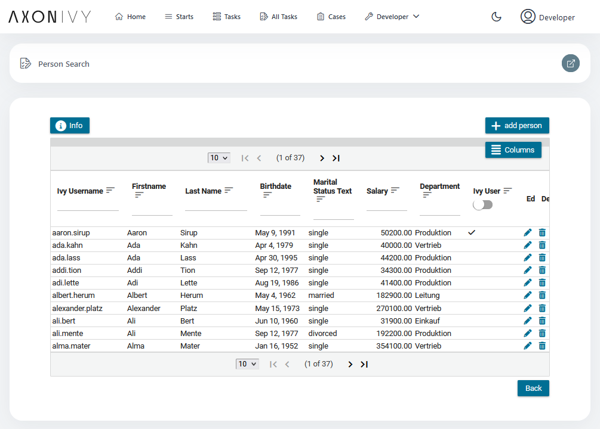
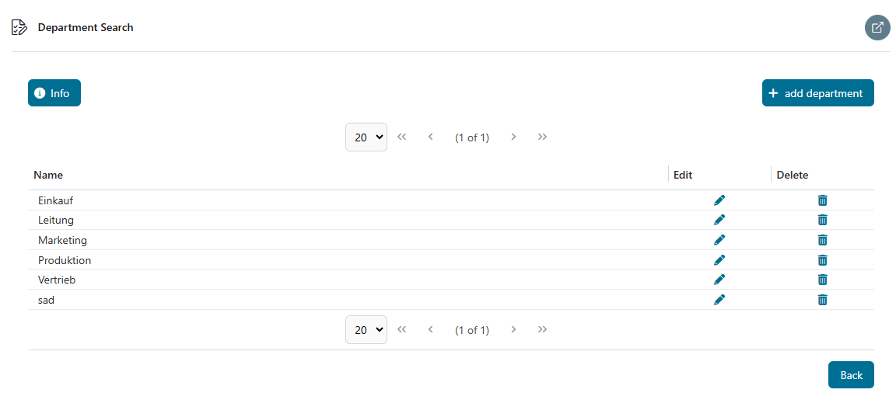
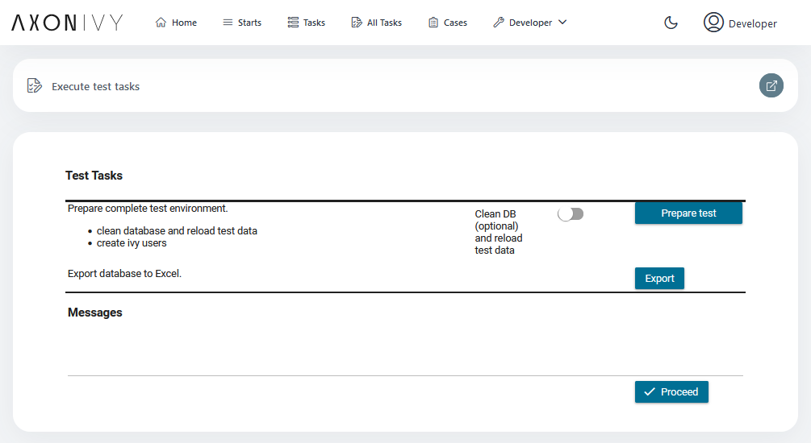

# Persistence Utils

Mit dieser Bibliothek vereinfachst du die Datenbankintegration für Axon Ivy-Prozesse. Die
Bibliothek stellt dir wiederverwendbare DAOs, Such- und Abfragehilfen, Transaktions- und
Entity-Manager-Utilities sowie Audit-/Historie-Unterstützung zur Verfügung und enthält ein
Demo-Projekt mit Testdaten, mit dem du Funktionen schnell ausprobieren kannst.

### Wichtigste Funktionen
- Vereinfachte Nutzung von JPA/Hibernate durch wiederverwendbare `GenericDAO`-Hilfen.
- Serverseitiges Filtern, Sortieren und Paginierung über Lazy-Data-Modelle für große Tabellen.
- Ivy-kompatibler Entity-Manager und Transaktions-Hilfen für sichere Prozessintegration.
- Integrierte Audit-/Historie- und Validierungshilfen für auditable Entities.
- Demo-Anwendung und Testdaten zum schnellen Validieren und Kennenlernen der Funktionen.

## Demo

Nachfolgend findest du kurze, benutzerorientierte Workflows, die die Demo-Szenarien aus dem
`persistence-utils-demo` Modul reproduzieren.

### Personensuche
1. Öffne die Demo und wähle auf der Startseite **Person Search** aus.
2. Gib Suchbegriffe ein oder nutze die Spaltenfilter, um die Ergebnisse einzuschränken; die Liste
   ist paginiert und unterstützt serverseitiges Sortieren und Filtern.
3. Klicke auf eine Zeile oder den **Add**-Button, um den Bearbeitungsdialog zu öffnen, ändere
   Felder und speichere deine Änderungen.



### Abteilungssuche
1. Öffne **Department Search** in der Demo.
2. Sieh dir die Abteilungsliste an, nutze die Paginierung zum Blättern und klicke auf **Add** oder
   das Bearbeiten-Symbol, um eine Abteilung anzulegen oder zu bearbeiten.



### Testdaten vorbereiten
1. Die Demo enthält eine einfache UI zur Testdatenaufbereitung, mit der du die Demo-Datenbank
   mit Beispielentitäten befüllst.



## Einrichtung
- Demo-Konfiguration: Das Demo-Modul verwendet eine In-Memory-Datasource; `hibernate.hbm2ddl.auto`
  ist im Demo für `create-drop` gesetzt. Für den produktiven Betrieb konfiguriere deine
  Datasource in `config/databases.yaml` und passe gegebenenfalls `persistence.xml` an.

## Komponenten

### Exponierte CALLABLE_SUB-Prozesse
- Dieses Produkt enthält keine CALLABLE_SUB-Prozessdateien im Hauptmodul.

### Formular-Komponenten
- Im Hauptmodul wurden keine Formular-Komponenten entdeckt.

### OpenAPI-Ressourcen
- Für dieses Produkt sind keine öffentlichen OpenAPI-Spezifikationen verfügbar.

### Maven-Artefakte

1. persistence-utils
```xml
<dependency>
  <groupId>com.axonivy.utils.persistence</groupId>
  <artifactId>persistence-utils</artifactId>
  <type>jar</type>
</dependency>
```

2. persistence-utils-demo
```xml
<dependency>
  <groupId>com.axonivy.utils.persistence</groupId>
  <artifactId>persistence-utils-demo</artifactId>
  <type>iar</type>
</dependency>
```

3. persistence-utils-demo-tool
```xml
<dependency>
  <groupId>com.axonivy.utils.persistence</groupId>
  <artifactId>persistence-utils-demo-tool</artifactId>
  <type>iar</type>
</dependency>
```
