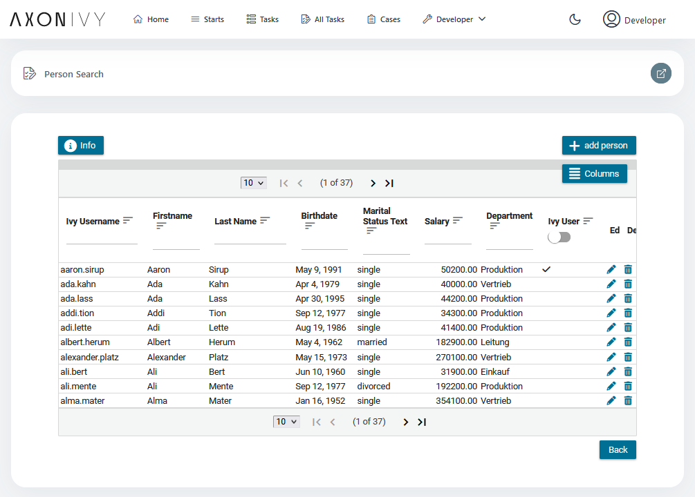
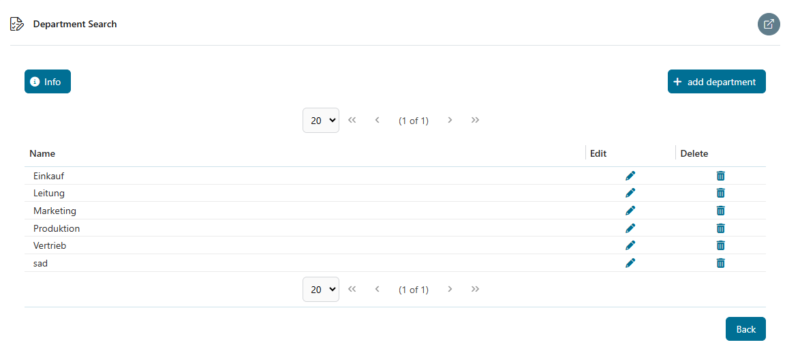
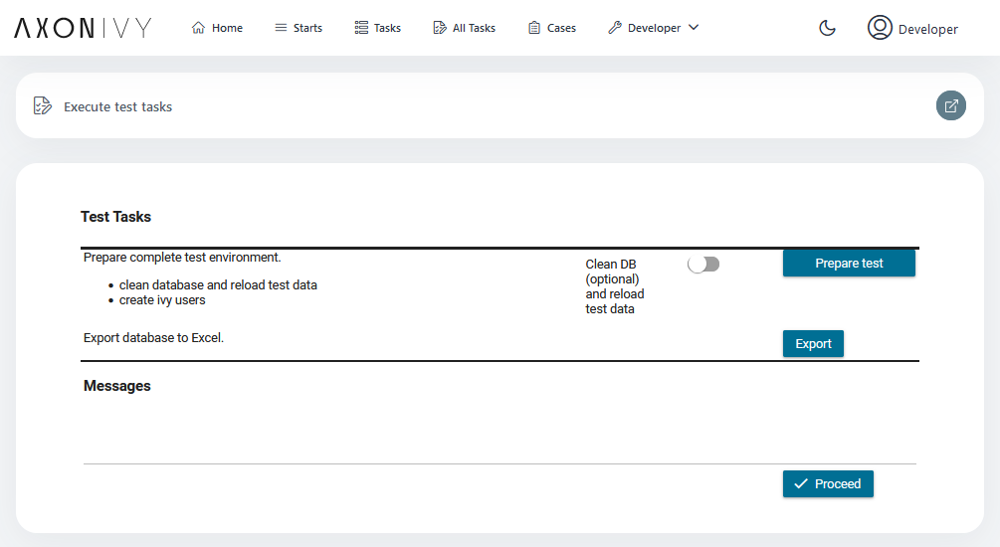

# Persistence Utils

Persistence Utils ist eine Bibliothek, die auf der Java Persistence API (JPA) basiert und dir hilft, ein datenbankbezogenes Axon Ivy-Projekt schnell zu starten. Sie stellt eine DAO-Abstraktionshierarchie bereit, die komplexere Datenbankzugriffe ermöglicht und die Nutzung vereinfacht.

Die Bibliothek unterstützt dich beim Erstellen von DAO-Klassen für deine Entities und beim Erzeugen typischer Entity-Klassen mit Boilerplate-Anforderungen, wie z. B. einfachen Audit-Feldern.

**Wichtigste Funktionen**

- Vereinfache die Datenbankintegration für Axon Ivy-Projekte mit JPA-basierten Hilfsmitteln.
- Biete eine DAO-Abstraktionsschicht, die Boilerplate reduziert und die Wartbarkeit verbessert.
- Erzeuge gängige Entity-Klassen mit integriertem Audit (Audit-Feldern).
- Enthält Demo-Module und Tools, die Entwicklung und Tests beschleunigen.
- Liefere Maven-kompatible Installer und Abhängigkeiten für einfache Paketierung und Deployment.
- Integriere Projektkonfiguration und rollenbasierte Zugriffssteuerung für sichere Datenoperationen.

## Demo

Sieh dir die bereitgestellten Demo-Implementierungen in den Demo-Modulen an. Sie zeigen benutzerorientierte Workflows wie Personensuche, Abteilungssuche und Gehaltserhöhungen.

### Demo-Workflows

#### Persistence Utils Demo (persistence-utils-demo)

##### Personensuche

1. Starte die Personensuche über das Demo‑Menü.
2. Es öffnet sich ein Dialog zur Personensuche mit einer durchsuchbaren Liste und Filtern.
3. Gib Suchkriterien ein oder verwende die Filter, um Personen zu finden, und wähle eine Person zur Anzeige aus.
4. Bearbeite oder speichere Personendaten; die Bestätigung zeigt die aktualisierten Werte an.



##### Abteilungssuche

1. Starte die Abteilungssuche über das Demo‑Menü.
2. Es öffnet sich ein Dialog mit der Abteilungsübersicht und zugehörigen Bedienelementen.
3. Verwende Suche und Filter, um Abteilungen zu finden und Details zu prüfen.
4. Bearbeite und speichere Änderungen; die Bestätigung zeigt die aktualisierten Daten an.



##### Gehaltserhöhungen

1. Starte die Gehaltserhöhungen über das Demo‑Menü.
2. Die Demo führt eine Gehaltsaktualisierung auf Beispieldaten aus; bestätige die Aktion, wenn du dazu aufgefordert wirst.
3. Prüfe die aktualisierten Gehaltswerte in der Personenliste oder in Berichten.

#### Persistence Utils Demo Tool (persistence-utils-demo-tool)

##### Testaufgaben ausführen

1. Starte "Testaufgaben ausführen" über das Demo‑Menü.
2. Es öffnet sich das Test Tasks‑Dialogfenster, in dem vordefinierte Testaktionen ausgeführt werden können.
3. Führe Aufgaben aus und prüfe die Ergebnisse und Protokolle.



## Einrichtung

- **Rollen:** Everybody (konfiguriert in config/roles.xml)
- **OpenAPI:** Keine Informationen wurden für diesen Abschnitt geliefert.

### Variablen

```yaml
# yaml-language-server: $schema=https://json-schema.axonivy.com/app/12.0.0/variables.json
# == Variables ==
# 
# You can define here your project Variables.
# If you want to define/override a Variable for a specific Environment, 
# add an additional ‘variables.yaml’ file in a subdirectory in the ‘Config’ folder: 
# '<project>/Config/_<environment>/variables.yaml
#
Variables:
#  myVariable: value
```

### Optionale Authentifizierungs- und Laufzeitabschnitte

- Keine Informationen wurden für diesen Abschnitt geliefert.

## Komponenten

### Aufrufbare Unterprozesse

- Keine Connector‑Prozesse wurden von dieser Erweiterung geliefert.

### Dialogkomponenten

- Es wurden keine Formularkomponenten von dieser Erweiterung geliefert.

### Webdienste

- Keine Informationen wurden für diesen Abschnitt geliefert.

### Maven‑Artefakte

1. persistence-utils

```xml
<dependency>
  <groupId>com.axonivy.utils.persistence</groupId>
  <artifactId>persistence-utils</artifactId>
  <type>jar</type>
</dependency>
```

2. persistence-utils-demo

```xml
<dependency>
  <groupId>com.axonivy.utils.persistence</groupId>
  <artifactId>persistence-utils-demo</artifactId>
  <type>iar</type>
</dependency>
```

3. persistence-utils-demo-tool

```xml
<dependency>
  <groupId>com.axonivy.utils.persistence</groupId>
  <artifactId>persistence-utils-demo-tool</artifactId>
  <type>iar</type>
</dependency>
```
